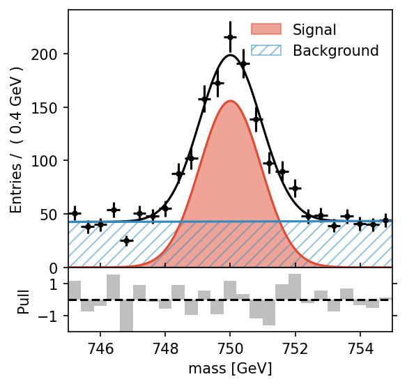

# pyminufit

[![Actions Status][actions-badge]][actions-link]
[![Documentation Status][rtd-badge]][rtd-link]

[![PyPI version][pypi-version]][pypi-link]
[![Conda-Forge][conda-badge]][conda-link]
[![PyPI platforms][pypi-platforms]][pypi-link]

[![GitHub Discussion][github-discussions-badge]][github-discussions-link]

<!-- SPHINX-START -->

<!-- prettier-ignore-start -->
[actions-badge]:            https://github.com/SimonUU/pyminufit/workflows/CI/badge.svg
[actions-link]:             https://github.com/SimonUU/pyminufit/actions
[conda-badge]:              https://img.shields.io/conda/vn/conda-forge/pyminufit
[conda-link]:               https://github.com/conda-forge/pyminufit-feedstock
[github-discussions-badge]: https://img.shields.io/static/v1?label=Discussions&message=Ask&color=blue&logo=github
[github-discussions-link]:  https://github.com/SimonUU/pyminufit/discussions
[pypi-link]:                https://pypi.org/project/pyminufit/
[pypi-platforms]:           https://img.shields.io/pypi/pyversions/pyminufit
[pypi-version]:             https://img.shields.io/pypi/v/pyminufit
[rtd-badge]:                https://readthedocs.org/projects/pyminufit/badge/?version=latest
[rtd-link]:                 https://pyminufit.readthedocs.io/en/latest/?badge=latest

<!-- prettier-ignore-end -->

This package is an interface to `iminuit` to allow for fast simple fits and
mimics the functionality of `PyrooFit` which is an interface on top of the
ROOT.RooFit package.

The package allows for simple fits of standard PDFs and easy setup of custom
PDFs in one or more fit dimensions.

### Links

| Description       | Link                                        |
| ----------------- | ------------------------------------------- |
| Documentation     | [pyminufit Documentation][rtd-link]         |
| GitHub Repository | [pyminufit GitHub Repository][actions-link] |

This package is based on top of [iminuit](https://scikit-hep.org/iminuit/). For
more information, you can refer to the
[iminuit documentation](https://iminuit.readthedocs.io/en/latest/).

## Example

Simple fit and plot of a Gaussian Distribution:

```python
from pyminufit.models import Gauss
import numpy as np

data = np.random.normal(0, 1, 1000)

pdf = Gauss(("x", -3, 3), mean=(-1, 0, 1))
pdf.fit(data)
pdf.plot(
    "example_gauss.pdf",
)

pdf.get()
```

A more complex example on combination of Gauss pdf for signal and Polynomial for
background:

```python
import pyminufit as mnf
import numpy as np

data = np.append(
    np.random.random_sample(1000) * 10 + 745, np.random.normal(750, 1, 1000)
)

x = mnf.create_real_var(("mass", 745, 755), unit="GeV")

pdf_sig = mnf.Gauss(x, mean=(745, 755), sigma=(0.1, 1, 2), title="Signal")
pdf_bkg = mnf.Chebyshev(x, order=2, title="Background")

pdf = pdf_sig + pdf_bkg

pdf.fit(data)
pdf.plot(data, "02_add_pdf.png", dpi=150)
pdf.get()
```



Observables can be initialised by a list or tuple with the column name /
variable name as first argument, followed by the range and/or with the initial
value and range:

```
x = ('x', -3, 3)
x = ('mass', -3, 0.02, 3)
```

Parameters are initialised with a tuple: `sigma=(0,1)` or again including a
starting parameter: `sigma=(0.01, 0, 1)` The order here is not important.

## Installation

You can install `pyminufit` directly from PyPI using pip:

```bash
pip install pyminufit
```

Alternatively, if you want to install the development version directly from
GitHub, you can do so with:

```bash
pip install git+https://github.com/simonuu/pyminufit.git
```

For a development installation, download the git reposityro and run:

```bash
pip install -e .
```

## Development

If you have any questions or need help with this package, your contributions are
greatly appreciated. This project is a side project, so any assistance is
welcome. When contributing, please follow design principles that prioritize
simplicity of the interface while preserving the complexity of the underlying
functionality. You can contribute by submitting a pull request (PR) to the
GitHub repository. For larger changes consider discussing ideas in GitHub
Issues. Thank you for your support!

## Planned Features

- [ ] ProdPdf: Product pdf for multiple observables
- [ ] Convolutions
- [ ] Shared parameters
- [ ] Backend options for the pdf calculation

---

This package was created using the scientific python template from
https://scientific-python.org/.
